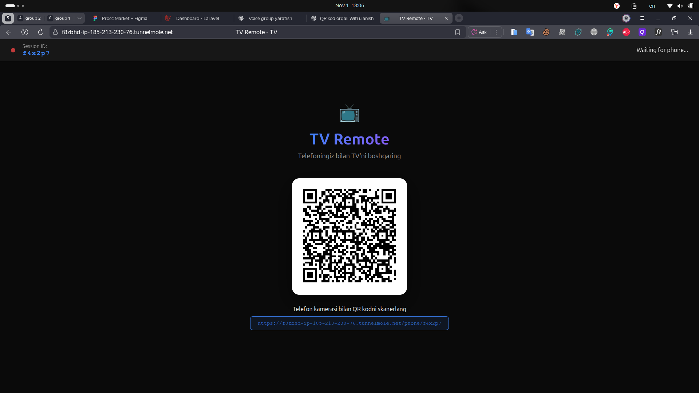
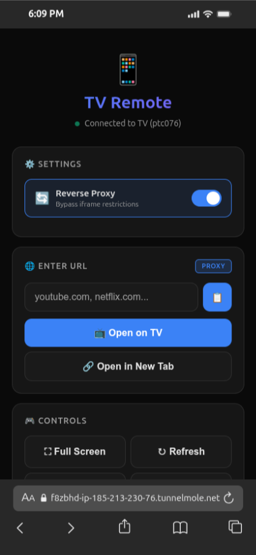

# 📺 TV Remote - Smart TV Controller

Professional web-based TV remote control system with advanced reverse proxy capabilities. Control your Smart TV from your phone using QR codes and WebSockets.


## ✨ Features

### 🎮 Core Functionality
- **QR Code Connection** - Instant pairing between TV and phone
- **Real-time Control** - WebSocket-based instant communication
- **URL Management** - Open any website on your TV
- **Fullscreen Mode** - Immersive viewing experience
- **Navigation Controls** - Back, refresh, and more

### 🔄 Advanced Reverse Proxy
- **URL Rewriting** - Automatically rewrites all URLs (HTML, CSS, JS)
- **Resource Interception** - Intercepts fetch() and XMLHttpRequest calls
- **Iframe Bypass** - Circumvents X-Frame-Options restrictions
- **Smart Caching** - 5-minute cache with 200 entry limit
- **Protocol Handling** - Supports HTTP, HTTPS, and protocol-relative URLs
- **Content-Type Aware** - Different handling for HTML, CSS, JS, images

### 📱 Phone Interface
- **Toggle Proxy** - Enable/disable reverse proxy on the fly
- **Visual Feedback** - Real-time status indicators
- **Bookmarks** - Quick access to favorite sites
- **History** - Track recently opened URLs
- **Haptic Feedback** - Vibration support for better UX
- **Persistent Settings** - Saves preferences locally

### 📺 TV Interface
- **Modern UI** - Clean, professional design
- **Status Bar** - Connection status and session info
- **Loading States** - Visual feedback during page loads
- **Error Handling** - Graceful error messages
- **New Tab Option** - Open blocked sites in separate tabs

## Screenshots

### TV Interface



### Phone Interface



## 🚀 Quick Start

### Prerequisites
- Node.js >= 14.0.0
- npm or yarn

### Installation

```bash
# Clone the repository
git clone https://github.com/iCoderNet/tv-remote.git
cd tv-remote

# Install dependencies
npm install

# Start the server
npm start
```

The server will start on `http://localhost:3000`

### Development Mode

```bash
# Run with auto-reload
npm run dev
```

## 📖 Usage Guide

### 1. Setup TV

1. Open `http://localhost:3000` on your TV's browser
2. A QR code will appear on screen
3. Note the session ID displayed

### 2. Connect Phone

1. Scan the QR code with your phone camera
2. Or manually navigate to the URL shown below QR code
3. Wait for "Muvaffaqiyatli ulandi! 🎉" message

### 3. Control TV

#### Open URLs
```
1. Enter URL in text field (e.g., "youtube.com")
2. Click "📺 Open on TV" button
3. Page loads on TV instantly
```

#### Proxy Settings
```
🟢 Proxy Enabled (default)
   - All resources load through proxy
   - Bypasses iframe restrictions
   - Better compatibility

🔴 Proxy Disabled
   - Direct connection
   - Faster for supported sites
   - May fail on restricted sites
```

#### Controls
- **⛶ Full Screen** - Enter fullscreen mode
- **⛶ Exit Full** - Exit fullscreen mode
- **↻ Refresh** - Reload current page
- **← Back** - Go back in history
- **🔗 New Tab** - Open URL in new tab on TV

### 4. Bookmarks & History

**Bookmarks**
- Pre-configured favorite sites
- One-click access
- Respect current proxy setting

**History**
- Tracks last 10 opened URLs
- Click to reopen
- Persists across sessions

## 🏗️ Architecture

### Technology Stack
- **Backend**: Express.js + Socket.IO
- **Frontend**: Vanilla JavaScript + HTML5
- **Real-time**: WebSocket connections
- **Proxy**: Axios with custom URL rewriting
- **QR Codes**: QRCode.js library

### File Structure
```
tv-remote/
├── server.js           # Main server with reverse proxy
├── package.json        # Dependencies and scripts
├── public/
│   ├── tv.html        # TV interface
│   └── phone.html     # Phone controller interface
└── README.md          # This file
```

### How Reverse Proxy Works

1. **Request Interception**
   ```javascript
   GET /proxy?url=https://example.com
   → Server fetches example.com
   → Rewrites all URLs to /proxy?url=...
   → Returns modified content
   ```

2. **URL Rewriting Process**
   - HTML: Rewrites `src`, `href`, `action` attributes
   - CSS: Rewrites `url()` functions
   - JS: Intercepts fetch() and XMLHttpRequest
   - Dynamic: Injects runtime URL interceptors

3. **Caching Strategy**
   ```
   Cache Key: Full URL
   Duration: 5 minutes
   Max Size: 200 entries
   Cleanup: Every 60 seconds
   ```

## 🔧 Configuration

### Environment Variables

```bash
# Server port (default: 3000)
PORT=3000
```

### Cache Settings

Edit in `server.js`:
```javascript
const CACHE_DURATION = 5 * 60 * 1000; // 5 minutes
const MAX_CACHE_SIZE = 200;           // 200 entries
```

### Session Settings

```javascript
const SESSION_EXPIRY = 3600000;  // 1 hour
const CLEANUP_INTERVAL = 300000; // 5 minutes
```

## 📡 API Reference

### Socket.IO Events

#### Client → Server

| Event | Payload | Description |
|-------|---------|-------------|
| `create-session` | - | TV creates new session |
| `join-session` | `sessionId` | Phone joins session |
| `open-link` | `{sessionId, url, useProxy}` | Open URL on TV |
| `fullscreen` | `sessionId` | Enter fullscreen |
| `exit-fullscreen` | `sessionId` | Exit fullscreen |
| `refresh` | `sessionId` | Refresh page |
| `go-back` | `sessionId` | Navigate back |
| `open-in-new-tab-on-tv` | `{sessionId, url}` | Open in new tab |

#### Server → Client

| Event | Payload | Description |
|-------|---------|-------------|
| `session-created` | `sessionId` | Session created successfully |
| `session-joined` | `{success, error?}` | Join result |
| `phone-connected` | - | Phone connected to TV |
| `phone-disconnected` | - | Phone disconnected |
| `tv-disconnected` | - | TV disconnected |
| `iframe-blocked` | `url` | Site blocked iframe |
| `open-link` | `{url, useProxy}` | Load URL command |
| `open-in-new-tab` | `url` | Open in new tab |

### HTTP Endpoints

#### `GET /`
TV interface homepage

#### `GET /phone/:sessionId`
Phone controller interface

#### `GET /proxy?url=<url>`
Reverse proxy endpoint

**Parameters:**
- `url` (required): Target URL to proxy

**Example:**
```bash
curl "http://localhost:3000/proxy?url=https://example.com"
```

## 🛠️ Troubleshooting

### Common Issues

**1. QR Code not showing**
- Check if server is running
- Verify port 3000 is not in use
- Clear browser cache

**2. Phone can't connect**
- Ensure phone and TV are on same network
- Check firewall settings
- Verify session ID is correct

**3. Proxy not working**
- Some sites block all iframe embedding
- Try "Open in New Tab" option
- Check server logs for errors

**4. Page loads blank**
- Website may use strict CSP headers
- Try disabling proxy
- Some sites require authentication

### Debug Mode

Enable detailed logging:
```javascript
// In server.js
console.log('→ Proxying:', fullUrl);
console.log('✓ Success:', fullUrl, `(${contentType})`);
console.log('✗ Proxy error:', error.message);
```

## 🎨 Customization

### Add Custom Bookmarks

Edit `phone.html`:
```html
<div class="bookmark-item" data-url="your-site.com">
  <div>
    <div class="bookmark-name">Your Site</div>
    <div class="bookmark-url">your-site.com</div>
  </div>
  <div class="bookmark-icon">🎬</div>
</div>
```

### Change Theme Colors

Edit CSS variables in `phone.html` or `tv.html`:
```css
:root {
  --bg-primary: #0a0a0a;
  --accent: #3b82f6;
  --success: #10b981;
  --error: #ef4444;
}
```

### Modify Proxy Behavior

In `server.js`, customize the `rewriteUrls()` function:
```javascript
function rewriteUrls(content, originalUrl, contentType) {
  // Your custom URL rewriting logic
}
```

## 🔒 Security Considerations

⚠️ **Important**: This is designed for personal/local network use.

- No authentication system
- Sessions expire after 1 hour
- Proxy can access any public URL
- Not recommended for production/public deployment
- Consider adding authentication for public use

## 🤝 Contributing

Contributions are welcome! Please follow these steps:

1. Fork the repository
2. Create feature branch (`git checkout -b feature/AmazingFeature`)
3. Commit changes (`git commit -m 'Add AmazingFeature'`)
4. Push to branch (`git push origin feature/AmazingFeature`)
5. Open Pull Request

## 📝 License

This project is licensed under the MIT License - see below for details:

```
MIT License

Copyright (c) 2024 TV Remote

Permission is hereby granted, free of charge, to any person obtaining a copy
of this software and associated documentation files (the "Software"), to deal
in the Software without restriction, including without limitation the rights
to use, copy, modify, merge, publish, distribute, sublicense, and/or sell
copies of the Software, and to permit persons to whom the Software is
furnished to do so, subject to the following conditions:

The above copyright notice and this permission notice shall be included in all
copies or substantial portions of the Software.

THE SOFTWARE IS PROVIDED "AS IS", WITHOUT WARRANTY OF ANY KIND, EXPRESS OR
IMPLIED, INCLUDING BUT NOT LIMITED TO THE WARRANTIES OF MERCHANTABILITY,
FITNESS FOR A PARTICULAR PURPOSE AND NONINFRINGEMENT. IN NO EVENT SHALL THE
AUTHORS OR COPYRIGHT HOLDERS BE LIABLE FOR ANY CLAIM, DAMAGES OR OTHER
LIABILITY, WHETHER IN AN ACTION OF CONTRACT, TORT OR OTHERWISE, ARISING FROM,
OUT OF OR IN CONNECTION WITH THE SOFTWARE OR THE USE OR OTHER DEALINGS IN THE
SOFTWARE.
```

## 📞 Support

- **Issues**: [GitHub Issues](https://github.com/iCoderNet/tv-remote/issues)
- **Discussions**: [GitHub Discussions](https://github.com/iCoderNet/tv-remote/discussions)
- **Email**: your.email@example.com

## 🙏 Acknowledgments

- [Socket.IO](https://socket.io/) - Real-time communication
- [Express.js](https://expressjs.com/) - Web framework
- [Axios](https://axios-http.com/) - HTTP client
- [QRCode.js](https://davidshimjs.github.io/qrcodejs/) - QR code generation

## 📊 Stats

- **Lines of Code**: ~2,500
- **Dependencies**: 3 main packages
- **Supported Browsers**: Chrome, Firefox, Safari, Edge
- **Mobile Support**: iOS Safari, Android Chrome

## 🗺️ Roadmap

- [ ] User authentication system
- [ ] Multi-device support (multiple phones)
- [ ] Virtual keyboard for TV
- [ ] Media controls (play, pause, volume)
- [ ] Screen mirroring
- [ ] Custom proxy rules
- [ ] Browser extension
- [ ] Mobile app (React Native)
- [ ] Voice commands
- [ ] Gesture controls

---

<div align="center">
  <strong>Made with ❤️ for better TV browsing experience</strong>
  <br><br>
  <a href="#-tv-remote---smart-tv-controller">⬆ Back to Top</a>
</div>